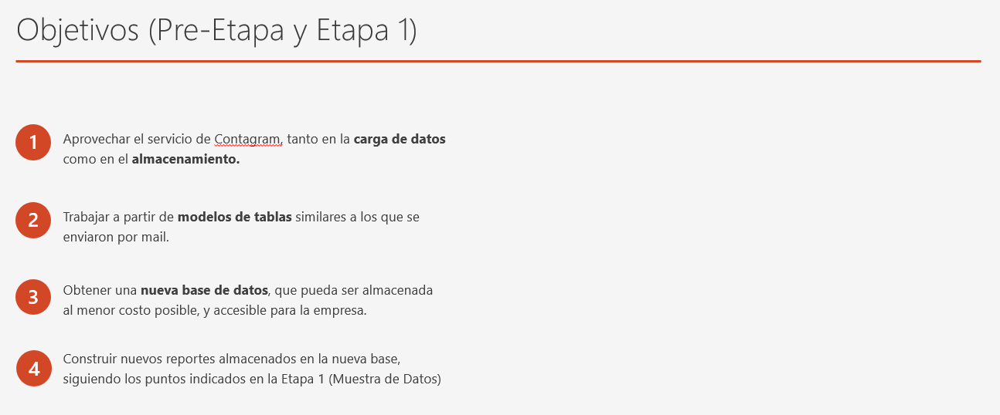
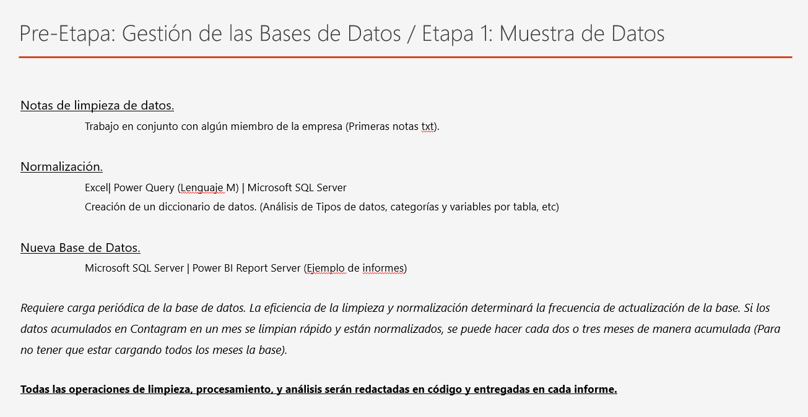
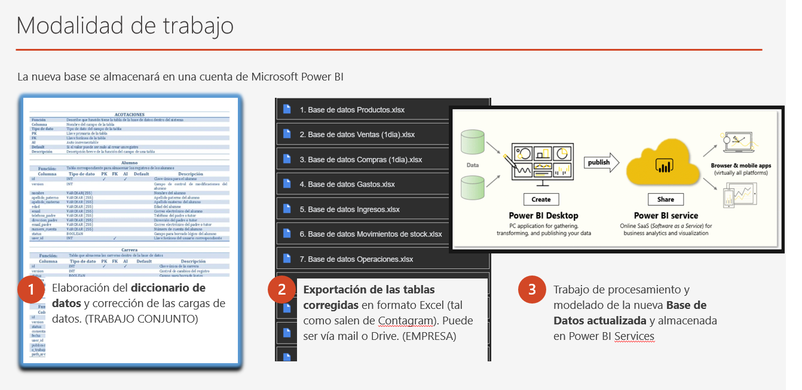

# Presentación de la propuesta de trabajo a los directivos de la empresa | Presentation of the work plan to the company's managers.

## Con el objetivo de migrar desde una base de datos AWS hacia una base de datos de Power Bi, se diseñó un plan de trabajo utilizando distintas herramientas de normalización de datos, así como la elaboración de una nueva base compatible con SQL y Power BI. | In order to migrate from an AWS database to a Power BI database, a work plan was designed using different data normalization tools, as well as the development of a new database compatible with SQL and Power BI. ##

## Las siguientes imágenes corresponden a la presentación trabajada en las reuniones: 

