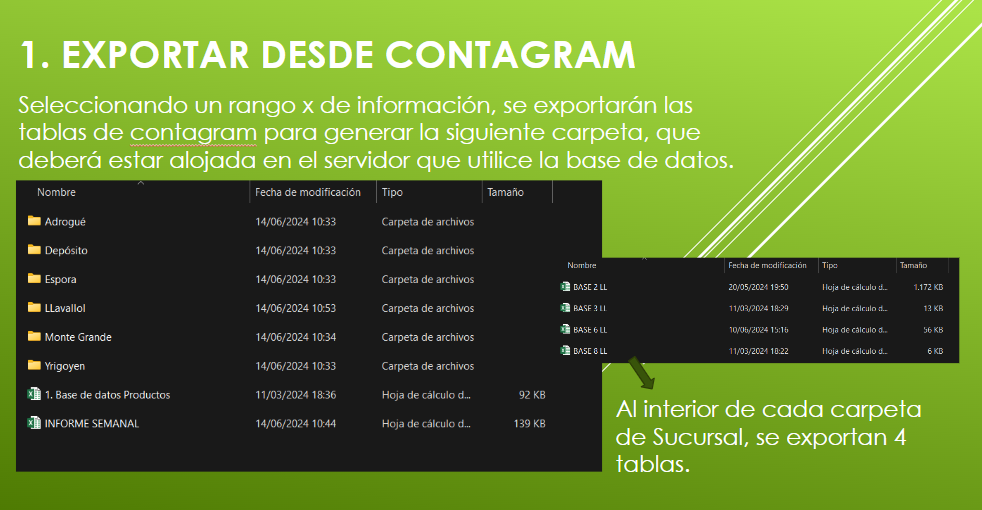
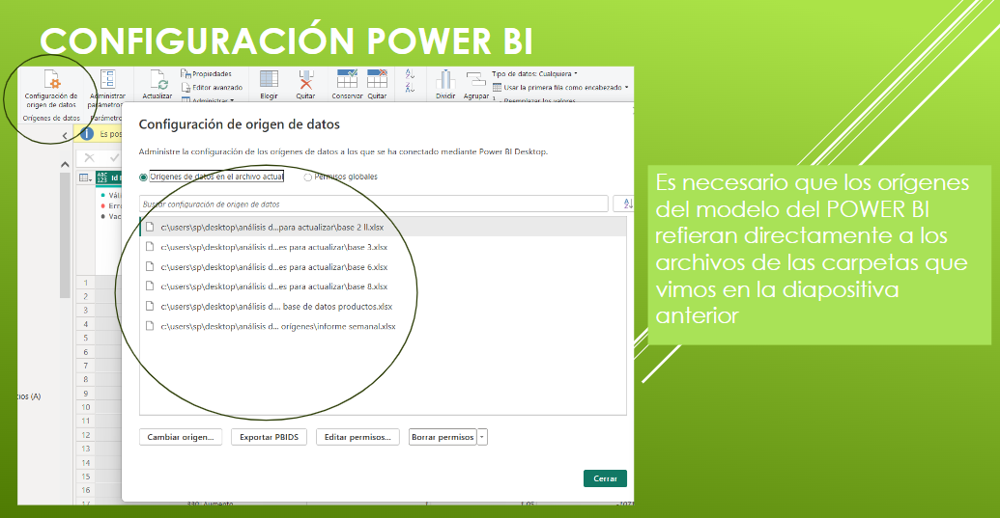

## Por último, se realizó una reunión para explicar cómo debía realizarse la actualización periódica de la base de datos. | Finally, we held a meeting to explain how the database should be updated periodically.

